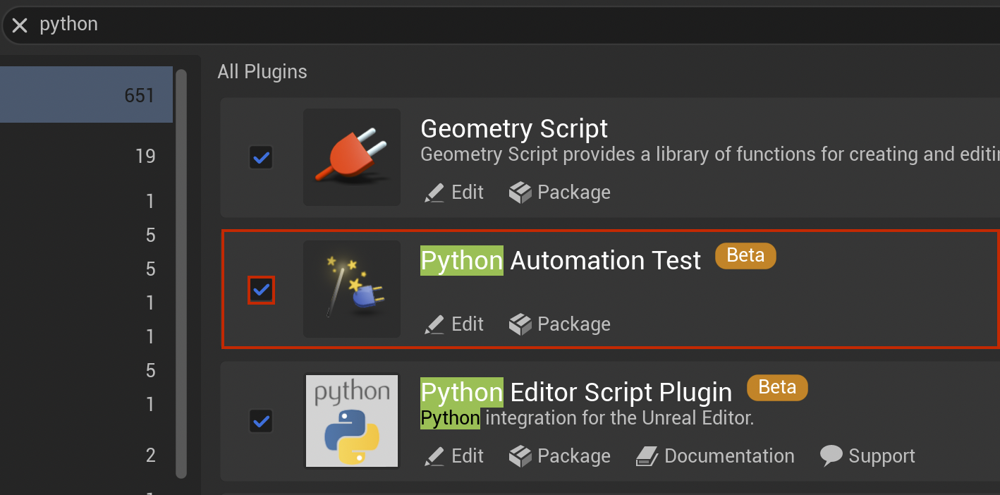
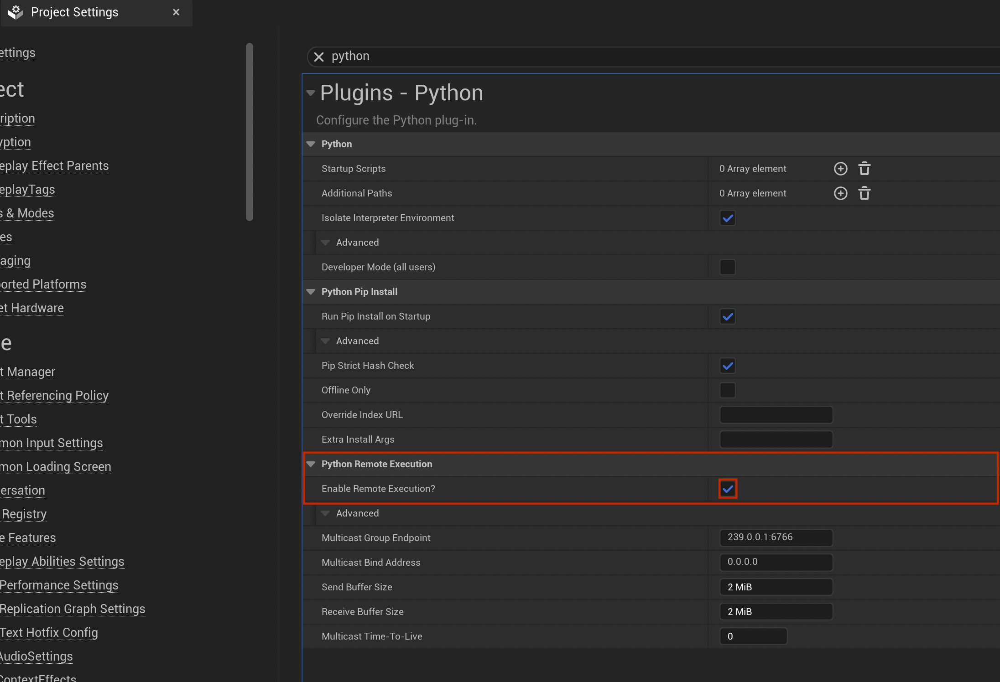

# unreal-mcp
> MCP server for Unreal Engine that uses Unreal Python Remote Execution


## Differences

This server does not require installing a new UE plugin as it uses the built-in Python remote execution protocol.

Adding new tools/features is much faster to develop since it does not require any C++ code.

It can support the full [Unreal Engine Python API](https://dev.epicgames.com/documentation/en-us/unreal-engine/python-api)

## Installation


1. Setting up your Editor:
   - Open your Unreal Engine project
   - Go to `Edit` -> `Plugins`
   - Search for "Python Editor Script Plugin" and enable it
   - Restart the editor if prompted
   - Go to `Edit` -> `Project Settings` 
   - Search for "Python" and enable the "Enable Remote Execution" option

  
  

2. Set up your Client:
   - Edit your Claude (or Cursor) config
```json
{
  "mcpServers": {
    "unreal": {
      "command": "npx",
      "args": [
        "-y",
        "@runreal/unreal-mcp",
      ]
    },
  }
}
```


### License MIT
